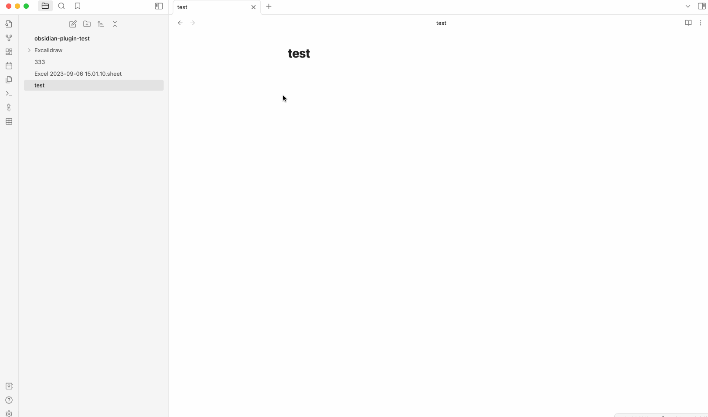

# Obsidian Excel Plugin

## Excel
The Obsidian-Excel plugin integrates [x-spreadsheet](https://github.com/myliang/x-spreadsheet), a feature sheet tool, into Obsidian. You can store and edit `xlsx` files in your vault.

### create sheet file

### import/export xlsx file
If you are using Microsoft Office 365 to create xlsx files, you need to import the display.

### embed link to markdown

### copy selected cells to HTML

### E-mail

- ljcoder@163.com

