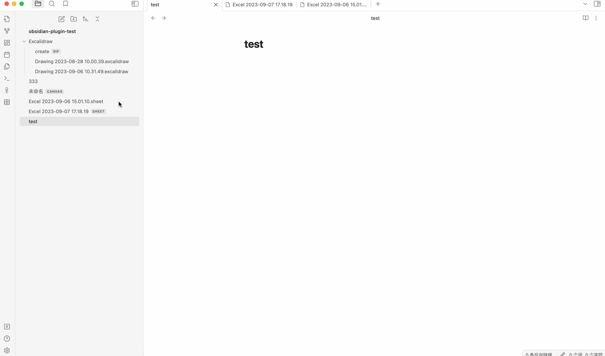

# Obsidian Excel Pro Plugin
**Obsidian Excel Pro** is here to revolutionize the way you handle spreadsheets within Obsidian. Built upon the foundation of its highly acclaimed predecessor, [Obsidian Excel](https://github.com/ljcoder2015/obsidian-excel), which has garnered over 25,000 users worldwide, **Obsidian Excel Pro** takes your experience to the next level.

**Online demo: https://univer.ai/examples/sheets/**

**Buy now:  https://www.patreon.com/obsidianExcelPro/membership**

**Discord: https://discord.com/invite/xckVHRYv**


Obsidian Excel Pro 现已面世，它将彻底改变您在 Obsidian 中处理电子表格的方式。基于备受赞誉的前身 Obsidian Excel 所奠定的基础上，后者已在全球范围内拥有超过 25,000 名用户。Obsidian Excel Pro 将您的体验提升到一个全新的层次。

**在线预览: https://univer.ai/examples/sheets/**

**购买地址: https://t.zsxq.com/ZMoYN**


# Obsidian Excel Plugin

## Excel
The Obsidian-Excel plugin integrates [x-spreadsheet](https://github.com/myliang/x-spreadsheet), a feature sheet tool, into Obsidian. You can store and edit `xlsx` files in your vault.

### create sheet file


### import/export xlsx file
If you are using Microsoft Office 365 to create xlsx files, you need to import the display.


### embed link to markdown

embed link rule:

```![[file-folder/file-name#sheet-name|sri-sci:eri-eci<sheet-height>{html}]]```

- `sri`: Start row index
- `eri`: End row index
- `sci`: Start column index
- `eci`: End column index
- `{html}`: Whether to display as HTML
- `<sheet-height>`: Sheet height, dispaly HTML not work





### copy selected cells to HTML


### Setting


### E-mail

- ljcoder@163.com

### buy a Coffee

[https://ko-fi.com/ljcoder](https://ko-fi.com/ljcoder)

